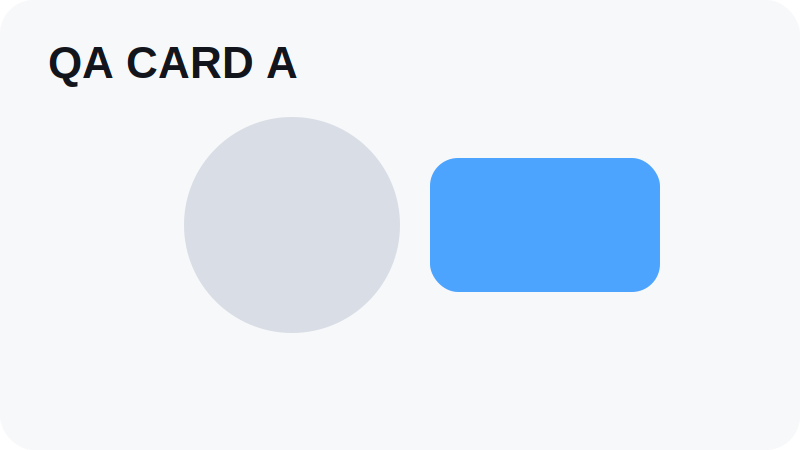
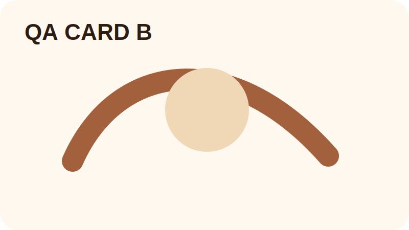
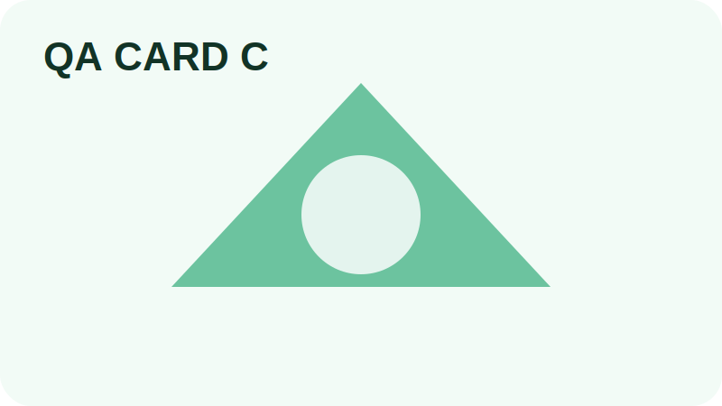
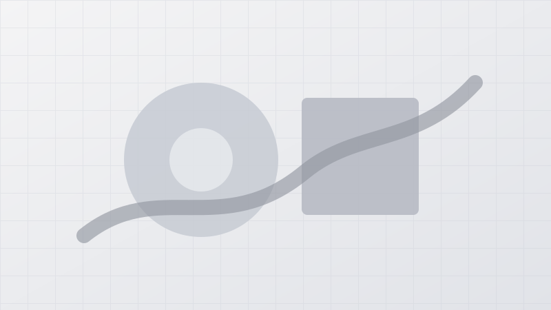

# Markdown Gallery Lab

::markdown-box
type: ssot
title: Visual QA 기준
::
이 페이지는 바룬툴즈 Markdown 컴포넌트의 시각 검수 기준판입니다.

- 실제 Markdown renderer를 통과합니다.
- intentionally broken sample은 실제 content에 넣지 않습니다.
- 오류/누락/경계 케이스는 fixture와 smoke script에서 검증합니다.
::

::section-gap
size: sm
::

## 1. Captioned Image

일반 Markdown image와 `captioned-image` directive의 tooltip/chip/lightbox 연결을 확인합니다.








::captioned-image
src: ./images/qa-card-b.svg
alt: 명시형 captioned image
caption: Directive 기반 캡션 툴팁입니다.
tag: 선택
lightbox: true
::

::section-gap
size: md
::


## 1.5. Captioned Image Frame

::markdown-box
type: ssot
title: Captioned Image Frame Contract
::
Captioned image의 badge, help button, tooltip은 반드시 image frame 내부 overlay로 귀속됩니다.  
badge는 줄바꿈/세로쓰기 없이 한 줄 pill 형태로 보여야 합니다.  
tooltip은 이미지 frame hover로 열리지 않고, 오직 `?` help button hover 또는 keyboard focus-visible 상태에서만 열립니다.
::


::section-gap
size: md
::

## 2. Before / After

기본 전후 비교와 세로형 이미지의 natural aspect-ratio 반영을 확인합니다.

::before-after
before: ./images/qa-before.svg
after: ./images/qa-after.svg
caption: 기본 전후 비교
initial: 50
::

::before-after
before: ./images/qa-before.svg
after: ./images/qa-after.svg
caption: initial 30 비교
initial: 30
::

::before-after
before: ./images/qa-before-tall.svg
after: ./images/qa-after-tall.svg
caption: 세로형 이미지 비율 검수
initial: 35
::

::section-gap
size: md
::

## 3. Pagecard Grid

명시 items와 registry query 기반 pagecard grid를 확인합니다.

::pagecard-grid
items: /wiper,/lab-markdown-gallery
columns: auto
::

::pagecard-grid
query: lab
limit: 3
sort: order
columns: compact
::

::pagecard-grid
items: /lab-markdown-gallery
columns: wide
::

::section-gap
size: md
::

## 4. Markdown Box

박스 타입, tone, collapsible, defaultOpen 상태를 확인합니다.

::markdown-box
type: note
title: Note
::
일반 메모 박스입니다.
::

::markdown-box
type: tip
title: Tip
::
작은 사용 팁을 담는 박스입니다.
::

::markdown-box
type: ssot
title: SSOT 기준
::
상태 귀속 위치를 명시하는 박스입니다.
::

::markdown-box
type: warning
title: 조용한 보정 금지
collapsible: true
defaultOpen: true
::
불명확한 값은 예쁘게 메우지 않고 warning으로 남깁니다.
::

::markdown-box
type: danger
title: Danger
::
실제 실패나 손실 가능성이 있는 상태를 강조합니다.
::

::markdown-box
type: quote
title: Quote
::
인용이나 관찰 기록을 담는 박스입니다.
::

::markdown-box
type: decision
title: 접힌 결정 기록
collapsible: true
defaultOpen: false
::
이 박스는 기본적으로 닫힌 상태로 시작합니다.
::

::section-gap
size: md
::

## 5. Image Card

이미지 카드가 captioned-image나 pagecard-grid와 섞이지 않고 독립 카드로 렌더되는지 확인합니다.

::image-card
src: ./images/qa-card-c.svg
alt: 이미지 카드 QA
caption: 이미지 카드 설명
tag: QA
href: /lab-markdown-gallery
::

::section-gap
size: md
::

## 6. Section Gap

Native section gap directive가 legacy token 없이 시각 간격을 만드는지 확인합니다.

위 문단입니다.

::section-gap
size: lg
::

아래 문단입니다.

::section-gap
size: md
::

## 7. Asset Registry Policy

::markdown-box
type: warning
title: Missing Asset QA 정책
::
실제 missing asset 샘플은 fixture와 smoke에서만 검증합니다.  
Visual QA 페이지는 validation-clean 상태를 유지합니다.
::

::markdown-box
type: ssot
title: Asset SSOT
::
콘텐츠 에셋 경로 판정은 Asset Registry 정책을 기준으로 합니다.  
Runtime과 validation이 서로 다른 방식으로 경로를 해석하지 않아야 합니다.
::

::section-gap
size: md
::

## 8. Legacy Migration Preview

::markdown-box
type: note
title: Legacy Audit Commands
::
이 프로젝트는 legacy 문법을 런타임에서 제한적으로 흡수하지만, 원본 정리는 CLI로 수행합니다.

```bash
npm run audit:legacy
npm run codemod:legacy
npm run codemod:legacy:write
```
::

::section-gap
size: md
::

## 9. Boundary Rule

::markdown-box
type: ssot
title: Nested Directive Boundary
::
`markdown-box` 내부에는 일반 Markdown만 넣습니다.  
`pagecard-grid`, `before-after`, `captioned-image` 같은 Vue directive는 top-level block으로 분리합니다.
::

::section-gap
size: md
::

## 10. Mobile Density Check

::markdown-box
type: tip
title: 모바일 확인 항목
::
- TOC floating button 위치
- caption tooltip touch target
- before-after slider handle
- pagecard grid column collapse
- collapsible box header height
::

::section-gap
size: md
::

## 11. Accessibility Check

::markdown-box
type: ssot
title: 접근성 확인 기준
::
이 페이지는 마우스 없이도 주요 상호작용을 확인할 수 있어야 합니다.

- Tab으로 TOC/카드/박스/이미지 설명 버튼 접근
- Enter/Space로 접힘 박스 토글
- Before/After slider 방향키 조작
- Escape로 모바일 TOC/Lightbox 닫기
- reduced motion 환경에서 과한 전환 감소
::


## 12. SEO Metadata Check

::markdown-box
type: ssot
title: SEO SSOT
::
페이지 제목, 설명, 대표 이미지는 Markdown frontmatter에서 가져옵니다.  
사이트 공통 origin과 default OG 이미지는 `siteConfig`에서 가져옵니다.
::


::section-gap
size: md
::

## 13. Video Player

::markdown-box
type: ssot
title: Native Video Playback QA
::
Commit 30은 스트리밍 인프라가 아니라 native video 재생 입구를 검수합니다.  
`preload: auto`, `playsInline`, native controls를 기준으로 준 실시간 재생감을 확인합니다.
::

::video-player
src: ./videos/qa-video.webm
poster: ./images/qa-video-poster.svg
title: Video Player QA
caption: Native video-player directive sample for progressive playback.
controls: true
autoplay: false
loop: true
muted: false
playsInline: true
preload: auto
::

::section-gap
size: md
::

## 14. Section Scoped Lightbox & Mini Gallery

::markdown-box
type: ssot
title: Mini Gallery Contract
::
이미지를 클릭하면 페이지 전체가 아니라, 현재 구분선 section 안의 이미지들만 라이트박스 갤러리로 묶입니다.  
섹션 안 이미지가 2개 이상이면, 마지막 이미지 아래에 mini gallery strip이 자동 생성됩니다.  
썸네일을 누르면 해당 section group만 라이트박스로 열립니다.
::


::section-gap
size: sm
::





::section-gap
size: md
::

## 15. Manual Gallery Strip

::markdown-box
type: ssot
title: Manual Gallery Contract
::
`gallery-strip`은 작성자가 직접 이미지 묶음을 선언하는 수동 갤러리입니다.  
이 directive가 있는 section에서는 자동 mini gallery가 중복 생성되지 않습니다.
::

::gallery-strip
title: Manual Strip Gallery
caption: strip layout sample.
layout: strip
lightbox: true
::
- ./images/qa-card-a.svg | Manual gallery A
- ./images/qa-card-b.svg | Manual gallery B
- ./images/qa-card-c.svg | Manual gallery C
::

::gallery-strip
title: Manual Grid Gallery
caption: grid layout sample.
layout: grid
lightbox: true
::
- ./images/qa-before.svg | Grid gallery A
- ./images/qa-after.svg | Grid gallery B
- ./images/qa-before-tall.svg | Grid gallery C
::

::section-gap
size: md
::

## 16. Gallery Magnifier

::markdown-box
type: ssot
title: Gallery Magnifier Contract
::
갤러리 썸네일에 마우스를 올리면 돋보기 박스가 나타납니다.  
돋보기 박스 안의 확대 영역은 마우스 포인터 또는 드래그 좌표를 따라 실시간으로 바뀝니다.

- 클릭 1회: 해당 이미지의 돋보기 비활성화
- 같은 이미지에서 0.1초 안에 한 번 더 클릭: 돋보기 재활성화
- 느린 두 번 클릭: double click으로 판정하지 않음
::

::section-gap
size: md
::

## 17. Lightbox Zoom Inspection

::markdown-box
type: ssot
title: Lightbox Zoom Contract
::
라이트박스 안의 큰 이미지는 확대/축소/드래그 이동이 가능합니다.

- `+` / `-` 버튼 또는 키보드로 확대/축소
- `0`으로 초기화
- 확대 상태에서 드래그 pan
- 이미지가 바뀌면 zoom/pan reset
- `Ctrl + wheel`로 stage 위에서 확대/축소
::

::section-gap
size: md
::

## 18. Mobile Touch Gallery

::markdown-box
type: ssot
title: Mobile Touch Contract
::
모바일 라이트박스에서는 손가락 입력을 기준으로 이미지를 조작합니다.

- 두 손가락 pinch: 확대/축소
- 확대 상태 한 손가락 drag: 이미지 pan
- 1x 상태 좌우 swipe: 이전/다음 이미지 이동
- double tap: 2x 확대 또는 reset
- thumbnail tray는 가로 스크롤을 유지합니다.
::

::section-gap
size: md
::

## 19. Lightbox Pan Clamp

::markdown-box
type: ssot
title: Lightbox Pan Boundary
::
확대된 이미지는 stage 밖으로 과하게 벗어나지 않도록 이동 범위가 제한됩니다.  
`Ctrl + wheel`, pinch, double tap 확대는 입력 지점을 기준으로 focal zoom을 수행합니다.
::


::section-gap
size: md
::

## 20. Lightbox Metadata

::markdown-box
type: ssot
title: Lightbox Metadata Contract
::
라이트박스는 현재 이미지의 제목, 캡션, 순번, 원본 경로, gallery group을 표시합니다.  
Copy 버튼은 현재 gallery/image index를 담은 공유 링크를 생성합니다.  
라이트박스 닫기/이전/다음/액션 버튼은 밝은 이미지 위에서도 icon/text가 명확히 보여야 하며, 모든 액션 버튼 텍스트는 중앙 정렬되어야 합니다.
::

::gallery-strip
title: Manual Metadata Gallery
caption: metadata panel sample.
layout: strip
lightbox: true
::
- ./images/qa-card-a.svg | 첫 번째 메타 이미지 | ./images/qa-card-a.svg | title=초기 시안; tool=Figma; tag=draft
- ./images/qa-card-b.svg | 두 번째 메타 이미지 | ./images/qa-card-b.svg | title=보정안; tool=Photoshop; tag=final
::

::section-gap
size: md
::

## 21. Authoring & Filing

::markdown-box
type: ssot
title: Content Filing Contract
::
새 페이지는 `src/content/pages/{category}/{slug}/index.md` 구조로 생성합니다.  
이미지와 영상은 해당 페이지 폴더 내부의 `images/`, `videos/`에 둡니다.  
새 페이지 생성은 `npm run new:page -- works project-name` 명령을 사용합니다.
::

::section-gap
size: md
::

## CSV Authoring

::markdown-box
type: ssot
title: CSV Authoring Contract
::
복잡한 Markdown directive를 직접 외우지 않고, `page.csv`를 작성한 뒤 `npm run csv:page`로 `index.md`를 생성합니다.  
CSV 기반 페이지에서는 `page.csv`가 작성 원본이고 `index.md`는 generated output입니다.
::

::section-gap
size: md
::

## 22. Responsive UI

::markdown-box
type: ssot
title: Responsive UI Contract
::
와이드 화면에서도 본문 타이포그래피와 카드 폭은 과하게 확대되지 않습니다.  
텍스트 본문은 읽기 폭을 유지하고, 모바일에서는 터치 UI 밀도를 보정합니다.  
반응형은 화면이 넓다고 모든 UI를 키우는 것이 아니라, 정보 밀도와 읽기 폭을 안정화하는 기준입니다.
::


## Store-ready Content Model

::markdown-box
type: ssot
title: Product Catalog Contract
::
스토어 확장을 위해 `products` category와 `product` frontmatter를 사용한다.  
Commit 48은 자체 결제 기능이 아니라 상품 카탈로그와 외부 구매 링크 기반 모델을 추가한다.  
상품 결제 링크는 Toss Payments URL을 `product.checkoutUrl`에 연결하고, 디지털 상품 다운로드는 추후 Cloudflare URL을 `product.downloadUrl`에 연결한다.  
상품 가격은 공개하며 `coming-soon`과 `sold-out` 상태도 `showWhenUnavailable: true` 기준으로 메인/목록 노출 후보에 포함한다.
::


::section-gap
size: md
::

## Homepage Index

::markdown-box
type: ssot
title: Homepage Index Contract
::
홈페이지는 works, products, tools, lab 데이터를 개별 페이지 frontmatter에서 수집해 섹션별 카드로 노출한다.  
상품은 가격을 공개하며, 준비중/품절 상품도 설정에 따라 목록에 표시한다.
::


## Seed Content Empty Section Contract

::markdown-box
type: ssot
title: Seed Content Empty Section Contract
::
Commit 50-0 기준으로 홈/스토어 섹션은 항목이 없을 때 개발자용 `No entries yet.` 문구를 직접 노출하지 않습니다.  
`::home-section`은 `emptyMode: notice` 또는 `emptyMode: hide`를 통해 사용자용 안내 카드 또는 섹션 숨김을 선택합니다.  
상품 seed는 실제 상품명, SKU, 가격, 구매 링크가 있을 때만 public content tree에 추가합니다.
::

::section-gap
size: md
::

## Media Breakout Contract

와이드 화면에서 본문 문단은 읽기 폭을 유지하고, 아래 미디어 컴포넌트들은 본문보다 넓은 rail로 펼쳐져야 한다.

- captioned image
- gallery strip
- video player
- before-after

markdown-box는 넓어지면 안 된다.

::markdown-box
type: ssot
title: Media Breakout Contract
::
텍스트 rail은 `--vt-content-max`에 남고, 미디어 rail은 `--vt-media-max`, 홈 카드 rail은 `--vt-home-max`에 귀속됩니다.

`markdown-box`는 구조/주의/SSOT 설명 블록이므로 wide rail로 빠져나가지 않습니다.
::

