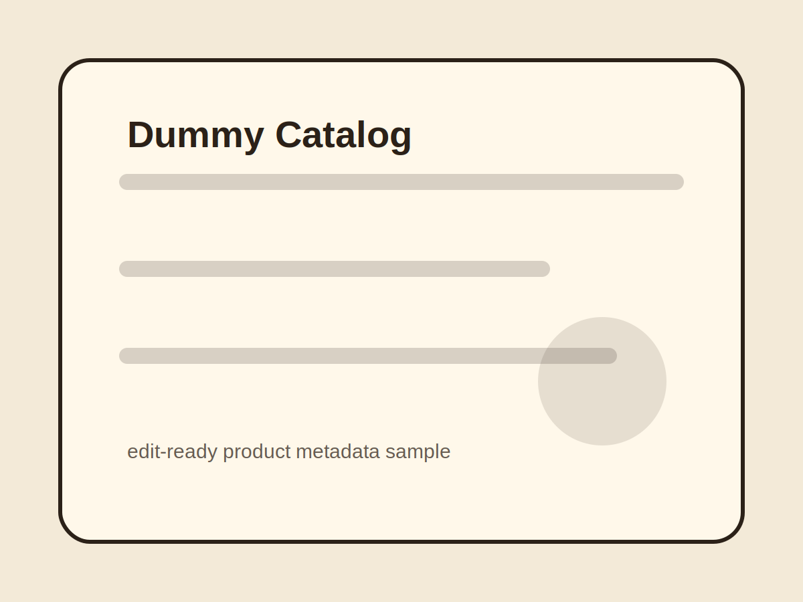

<!--
GENERATED FROM src/content/pages/products/dummy-catalog/page.csv.
Do not edit this file directly.
Run: npm run csv:page -- src/content/pages/products/dummy-catalog/page.csv
-->

# 더미 카탈로그 상품

::markdown-box
type: ssot
title: 첨삭용 더미 페이지
::
이 페이지는 상품 상세 구조와 taxonomy 필터를 눈으로 확인하기 위한 더미입니다. 실제 판매 상품으로 바꿀 때 제목 설명 이미지 가격 상태 링크 정책 메모를 순서대로 교체합니다.
::

::product-cta
::

::product-trust
::

::section-gap
::

## Taxonomy 첨삭 체크리스트

1. category는 상품이 놓일 매대를 고릅니다. 2. type은 제공 방식을 고릅니다. 3. collection은 브랜드나 기획 묶음을 고릅니다. 4. series는 연작이나 세트명을 kebab-case로 입력합니다. 5. tags에는 검색 보조어만 남깁니다.

::gallery-strip
title: 더미 상품 이미지
caption: 대표 이미지와 상세 이미지를 나중에 교체하기 위한 자리입니다.
layout: grid
lightbox: true
::
- ./images/cover.svg | 더미 대표 이미지 | ./images/cover.svg | title=대표컷; tag=dummy
::
