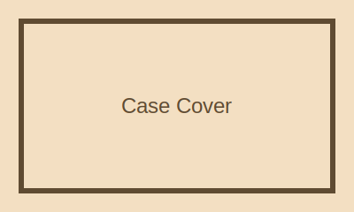

<!--
GENERATED FROM src/content/templates/csv-fixtures/case-study-basic/page.csv.
Do not edit this file directly.
Run: npm run csv:page -- src/content/templates/csv-fixtures/case-study-basic/page.csv
-->

::markdown-box
type: note
title: Fixture Case Study
::

A case-study fixture that exercises portfolio blocks.

**Role**

- Design Engineer

- Frontend

**Stack**

- Vue

- TypeScript

- Cloudflare Workers

**Year:** 2026

**featured:** true
::

::markdown-box
type: note
title: Work Summary
::
This page locks the case-study CSV contract.

**Period:** 2026

**Client:** internal
::

::markdown-box
type: warning
title: Problem
::
CSV blocks can regress silently when parser logic changes.

**severity:** high
::

::markdown-box
type: decision
title: Decision
::
Fixture files become regression contracts for the authoring pipeline.

**Weight:** high

**SSOT:** csv-fixtures
::

::markdown-box
type: tip
title: Result
::
The generated Markdown keeps portfolio metadata and narrative sections intact.

**status:** sealed
::

::markdown-box
type: tip
title: Fixture Coverage
::
**7 checks**

Representative authoring contracts protected by this fixture.
::

::markdown-box
type: note
title: Tool Stack
::
**Stack**

- Vue

- TypeScript

- Cloudflare Workers

**Storage**

- D1

- R2
::

> Fixture는 예제가 아니라 계약이다.
> — VarunTools

::gallery-strip
title: Case Gallery
layout: framed
columns: 2
::
- ./gallery-a.svg | Admin dry-run audit ledger |  | alt=Audit ledger; label=audit
- ./gallery-b.svg | CSV diagnostics report |  | alt=CSV diagnostics; label=csv
::

::markdown-box
type: note
title: Related Works
::
- csv-authoring
- varuntools-store
::
