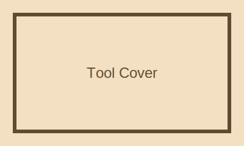

<!--
GENERATED FROM src/content/templates/csv-fixtures/tool-showcase/page.csv.
Do not edit this file directly.
Run: npm run csv:page -- src/content/templates/csv-fixtures/tool-showcase/page.csv
-->

::markdown-box
type: note
title: Tool Showcase
::

A tool-oriented fixture for work metadata.

**Role**

- Tool Designer

- Frontend

**Stack**

- Vue

- TypeScript

**Year:** 2026
::

::markdown-box
type: note
title: Role Stack
::
**Role**

- Tool Designer

- Frontend

**Stack**

- Vue

- TypeScript

**Tools**

- Vite

- CSV Parser
::

::markdown-box
type: note
title: Process
::
The fixture moves from schema to render to collection normalization.

**phase:** fixture
::

::markdown-box
type: note
title: Solution
::
Typed options feed the tool metadata and Markdown rendering layer.

**strategy:** typed-options
::

::markdown-box
type: tip
title: Result
::
The tool metadata remains readable by the works collection.

**Impact:** collection-ready
::
